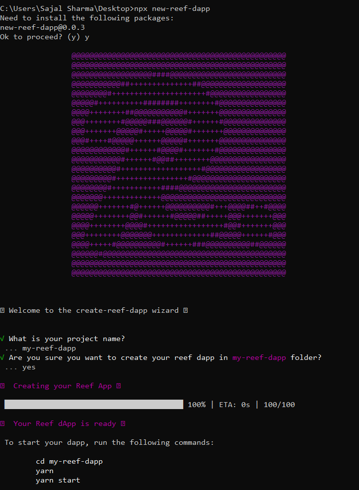
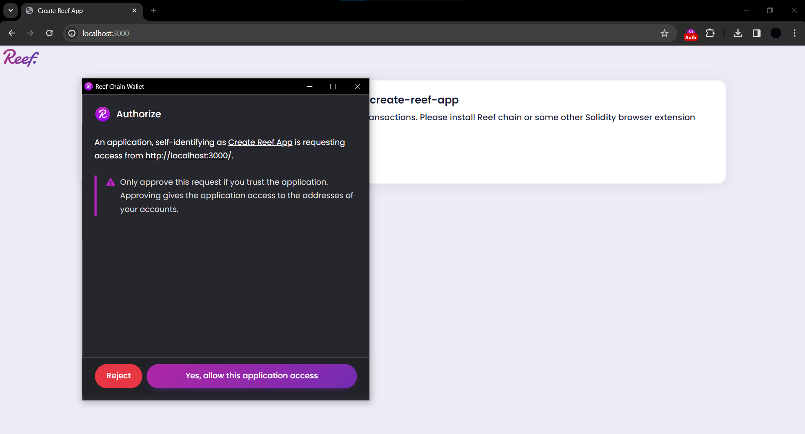

# create-reef-app
sample app for reef-chain uses react-lib for easy onboarding of devs

use the command ``` npx create-reef-app ``` to create a sample project, on top of which you can build your application. 
After running the command you will see instructions on the terminal itself, just like this-




On your first run - it will ask you to authorize the app to use reef-extension, also keep in mind that , you need reef browser extension installed in your browser to use this, i will be adding more features to this boiler plate and refactoring the code soon.


Serves a really basic sample Greeter smart contract , which allows to fetch and update data 
## Usage 
- Input some text and click on `Update Greeting` button, extension will pop up , sign the transaction , the Greeting will be updated shortly


